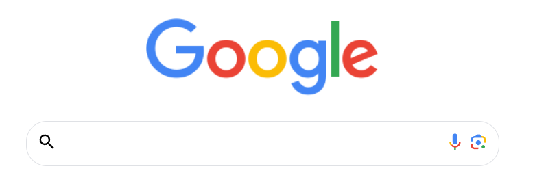
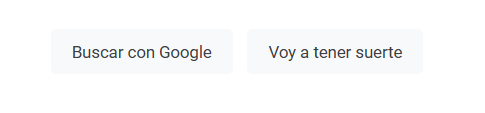
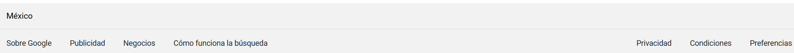

# Clon de Google  💜🐱

El presente proyecto es un clon de Google desarrollado para poner en practica las habilidades obtenidas dentro del bootcamp
de desarollo fronted de Tecnolochicas PRO.

Fue desarrollado con HTML, CSS y JS con el uso de el framework de UI, Bootstrap utilizando además bibliotecas externas.

La pagina es responsiva (adaptable a diferentes tamaños de pantalla).

[Proyecto desplegado (https://inspiring-zabaione-14f512.netlify.app)](https://inspiring-zabaione-14f512.netlify.app)

## Secciones de mi sitio

## Tecnologias 
* HTML
* CSS
* Bootstrap 
* Javascript

---
Desarrollado con  💜 por [Karla Velazquez](https://karla-velazquez.netlify.app/#) en [TECHNOLOCHICAS PRO](https://tecnolochicas.mx/)

